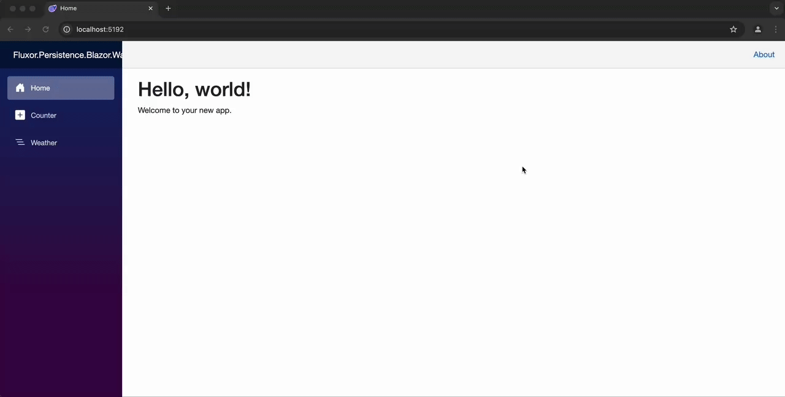

# Fluxor.Persistence.Extensions


Fluxor.Persistence.Extensions is a seamless extension to [Fluxor](https://github.com/mrpmorris/Fluxor) that introduces state persistence. It allows you to save and restore your application's state using your preferred storage mechanism.

## Getting Started

### Installation

You can install the package via NuGet:

```bash
dotnet add package Fluxor.Persistence.Extensions
```
* [Fluxor.Persistence](https://www.nuget.org/packages/Fluxor.Persistence/) [](https://www.nuget.org/packages/Fluxor.Persistence/)

### Configuration

Integrate the persistence mechanism into your project by configuring Fluxor in your `Program.cs`:

```csharp
builder.Services.AddFluxor(options =>
{
    options.ScanAssemblies(typeof(Program).Assembly);
    options.UsePersist(cfg =>
    {
        cfg.ForState<CounterState>().AddFullStatePersistence();

        cfg.ForState<WeatherState>()
            .AddPropertyPersistence(x => x.SelectedCity)
            .AddPropertyPersistence(x => x.TemperatureUnit);
    });
});
```

#### Handling Nested Properties

Fluxor.Persistence.Extensions also supports nested properties. Here's how you can configure it:

```csharp
cfg.ForState<UserSettings>()
    .AddPropertyPersistence(x => x.Theme.Colours.Pallette)
    .AddPropertyPersistence(x => x.Theme.IsDarkTheme);
```

### Custom Persistence Service

By default, the extension uses [Blazored.LocalStorage](https://github.com/Blazored/LocalStorage) for storing state. If you need a different storage solution, implement the `IPersistenceService` interface:

```csharp
internal sealed class InMemoryPersistenceService : IPersistenceService
{
    private readonly ConcurrentDictionary<string, string> _storage = new();

    public ValueTask<string?> GetItemAsStringAsync(string storageKey)
    {
        _storage.TryGetValue(storageKey, out var value);
        return ValueTask.FromResult<string?>(value);
    }

    public ValueTask SetItemAsStringAsync(string storageKey, string value)
    {
        _storage[storageKey] = value;
        return ValueTask.CompletedTask;
    }
}
```

Then, register your custom service:

```csharp
builder.Services.AddSingleton<IPersistenceService, InMemoryPersistenceService>();
```

## Examples

For practical implementations, check out the Blazor WASM example:

- **Blazor WASM Example:** [FluxorPersistence.Blazor.Wasm](Examples/Fluxor.Persistence.Blazor.Wasm/Fluxor.Persistence.Blazor.Wasm.csproj)

## Demonstration
Check out the following GIF to see state persistence in action within a Blazor WASM application:



## Contributing

Contributions are welcome! Feel free to open issues or submit pull requests for improvements and new features.

## License

This project is licensed under the [MIT License](LICENSE).
